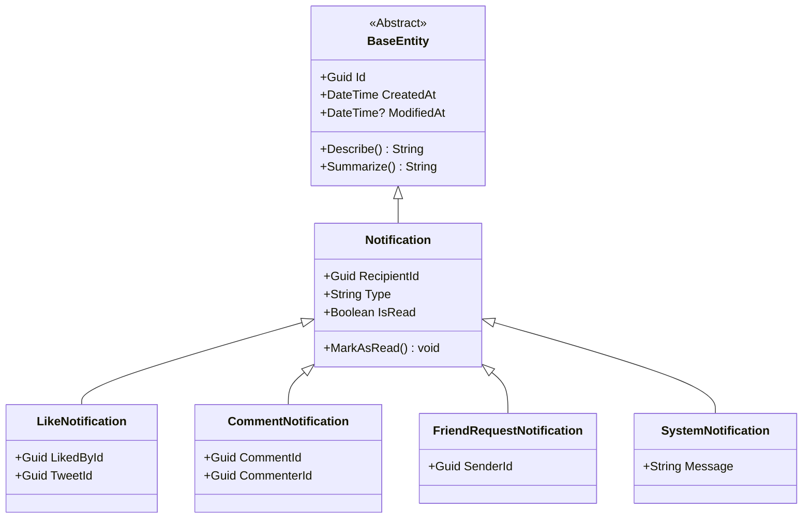

# TwitterClone

A backend clone of Twitter (X) built with .NET 10.0 focusing on Domain-Driven Design (DDD) principles and core Object-Oriented Programming (OOP) concepts: **Encapsulation**, **Inheritance**, and **Polymorphism**.

---

## Project Architecture & Directory Structure

The solution contains a class library project for the core domain model:

```text
TwitterClone/
├── TwitterClone.sln
├── README.md
├── .gitignore
└── TwitterClone.Domain/
    ├── TwitterClone.Domain.csproj
    └── Entities/
        ├── BaseEntity.cs
        ├── User.cs
        ├── Tweet.cs
        ├── Like.cs
        ├── Retweet.cs
        ├── Follow.cs
        ├── Message.cs
        ├── Bookmark.cs
        ├── Notification.cs
        ├── LikeNotification.cs
        ├── CommentNotification.cs
        ├── FriendRequestNotification.cs
        └── SystemNotification.cs
```

---

## Domain Entity Design & OOP Concepts

### 1. Base Entity (`BaseEntity`)
An abstract base class that encapsulates identifier generation and auditing metadata for all domain entities.
- **Properties**:
  - `Guid Id` (Globally Unique Identifier, auto-generated using `Guid.NewGuid()`)
  - `DateTime CreatedAt` (Auto-initialized to `DateTime.UtcNow`)
  - `DateTime? ModifiedAt`
  - `Guid CreatedBy`
  - `Guid? ModifiedBy`
- **Polymorphism**:
  - `Describe()`: Virtual method returning entity info.
  - `Summarize()`: Virtual method returning the entity summary.

### 2. Core Entities & Encapsulation
Encapsulation is enforced throughout the domain models via restricted setters, validation rules, and constructor parameter injection.

- **`User`**
  - **Validation**: Username cannot be null/empty. Email must contain `@` and cannot be null/empty.
  - **State**: Encapsulated behind private backing fields `_username` and `_email`.

- **`Tweet`**
  - **Validation**: Content cannot be empty and is capped at `280` characters.
  - **State**: Modifications are controlled via the `SetContent(content)` method, which also automatically updates `ModifiedAt`.
  - **Polymorphism**: Overrides `Describe()` and `Summarize()` to output the tweet content and metadata.

- **`Like` / `Retweet` / `Bookmark`**
  - Association classes capturing relationships between a `User` and a `Tweet`.

- **`Follow`**
  - **Validation**: Users are prevented from following themselves (`followerId == followeeId`).

- **`Message`**
  - **Validation**: Message content cannot be null/empty.

---

### 3. Inheritance Hierarchy: Notifications
A robust hierarchical system modeled for notifications. `Notification` acts as the base class, with specialized sealed classes implementing specific notification payloads:



- **`Notification`**: Base notification tracking `RecipientId`, `Type`, and `IsRead` state. Includes a `MarkAsRead()` method that changes status and stamps `ModifiedAt`.
- **`LikeNotification`**: Fired when a tweet is liked. Tracks the liker (`LikedById`) and the corresponding `TweetId`.
- **`CommentNotification`**: Fired when a comment is posted. Tracks the commenter (`CommenterId`) and the `CommentId`.
- **`FriendRequestNotification`**: Fired on a new friend request. Tracks the request sender (`SenderId`).
- **`SystemNotification`**: Used for global/system-wide alerts. Includes validation that the `Message` string cannot be empty.

---

## Build & Validation

To compile and validate the domain library, run the following commands:

```bash
# Restore dependencies and build the solution
dotnet build
```

The domain logic is fully encapsulated and compiles clean with zero warnings or errors.

---

## Active Development Branch

All entities and updates have been pushed to the feature branch:
`feature/implement-twitter-domain-entities`